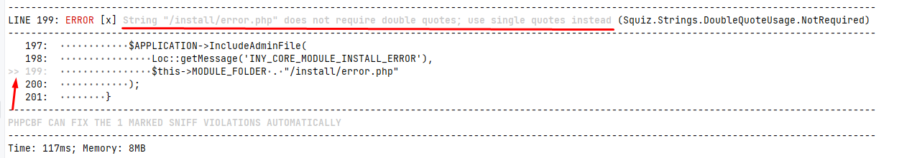
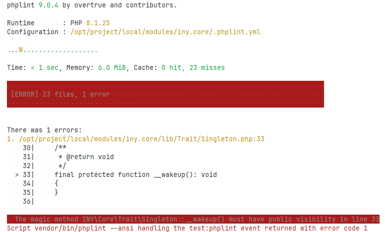

# Подключение тестов к своему проекту

В корне проекта создаем `composer.json`

```json
{
  "scripts": {
  },
  "require": {
    "wikimedia/composer-merge-plugin": "dev-master"
  },
  "extra": {
    "merge-plugin": {
      "require": [
        "./local/modules/iny.core/composer.json"
      ]
    }
  },
  "config": {
    "allow-plugins": {
      "wikimedia/composer-merge-plugin": true
    }
  }
}
```

В scripts добавляется запуск тестов, пример:

```json
{
  ...
  "scripts": {
    "test:all": [
      "@test:phplint",
      "@test:phpcs"
    ],
    "test:phplint": "vendor/bin/phplint ./local/ --ansi --configuration=./local/modules/iny.core/.phplint.yml",
    "test:phpcs": "vendor/bin/phpcs --standard=./local/modules/iny.core/phpcs.xml --runtime-set testVersion 8.1 ./local/"
  },
  ...
}
```

Ниже будет более подробное описание.

## PHP CodeSniffer

PHPCS - это инструмент командной строки с открытым исходным кодом, который используется для обнаружения нарушений
стиля кодирования, заданных стандартом кодирования. Он также предоставляет автоматические исправления для правил,
которые могут быть исправлены автоматически. PHPCS может использоваться между проектами и командами для обеспечения
совместного использования правил.

### Запуск

```bash
vendor/bin/phpcs --standard=./local/modules/iny.core/phpcs.xml --runtime-set testVersion 8.1 ./local/
 ```



## PHPLint

PHPLint - это инструмент статического анализа кода на PHP, который проверяет синтаксис и выявляет потенциальные
проблемы. Инструмент обнаруживает ошибки, предупреждения и несоответствия стандартам кодирования PHP. PHPLint
анализирует код без его фактического выполнения, что позволяет выявлять проблемы на ранних стадиях разработки и повышает
качество кода. Этот инструмент особенно полезен для обнаружения ошибок, которые могут привести к непредсказуемому
поведению программы или уязвимостям безопасности. PHPLint помогает разработчикам создавать надежные и безопасные
приложения на PHP.

### Запуск

```bash
vendor/bin/phplint ./local/ --ansi --configuration=./local/modules/iny.core/.phplint.yml
 ```


